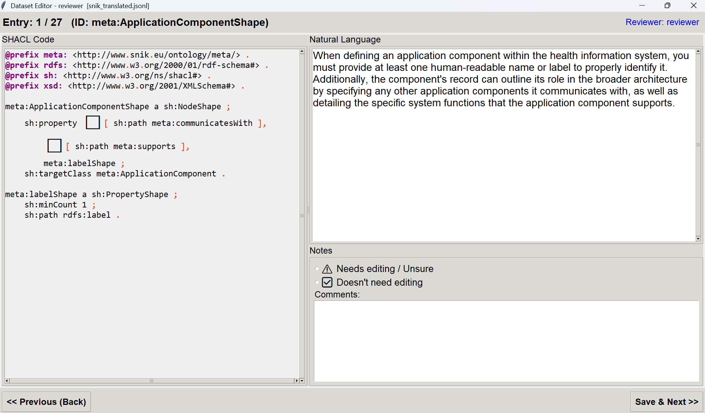

# Description Reviewer

This module provides a graphical interface for reviewing and editing LLM-generated natural language descriptions of SHACL shapes. It is part of the Dataset Construction pipeline in NL2SHACL-Framework.

Annotators use this tool to verify that each generated description accurately and completely reflects the constraints in the corresponding SHACL shape, and to flag or edit descriptions that require correction.



---

## Requirements

No additional packages are required beyond the Python standard library. The UI is built with `tkinter`, which is included in standard Python distributions.

---

## Usage

```bash
python UI_annotator.py
```

On launch, the tool will look for a file named `dcat_nl.jsonl` in the current directory. If not found, a file picker dialog will open to let you select the input file manually.

You will then be prompted to enter your name, which is used to name the output file:

```
corrected_dcat_dataset_<name>.jsonl
```

---

## Input Format

The input file is a `.jsonl` file where each line contains a record with at least the following fields:

| Field | Description |
|-------|-------------|
| `id` | Record identifier |
| `shacl` | The reference SHACL shape in Turtle format |
| `nl` | The generated natural language description to be reviewed |

---

## Interface

The UI is split into two panels:

- **Left panel**: displays the SHACL shape with syntax highlighting. Each property shape block has a clickable checkbox for tracking which constraints have been verified.
- **Right panel**: displays the editable natural language description, a notes field for comments, and a decision radio button.

For each record, the annotator should:

1. Read the SHACL shape on the left.
2. Edit the natural language description on the right if needed.
3. Select one of the two options:
   - **Needs editing / Unsure**: marks the record as flagged for further discussion.
   - **Doesn't need editing**: marks the record as reviewed and accepted.
4. Optionally add a comment.
5. Click **Save & Next** to proceed.

Use **Previous** to go back and revise an earlier entry. The tool saves progress automatically on every navigation step, so the session can be resumed at any time by re-running the script.

**Keyboard shortcut**: `Ctrl+F` opens an inline search bar within the natural language panel.

---

## Output Format

The output file contains one JSON record per line, with the following fields:

| Field | Description |
|-------|-------------|
| `id` | Record identifier |
| `shacl` | The SHACL shape (unchanged) |
| `nl` | The reviewed and possibly edited natural language description |
| `comment` | Annotator comments, if any |
| `flagged` | `true` if the record was marked as needing further editing |
| `checked` | `true` if the record has been reviewed |

---

## Notes

- The tool automatically resumes from the first unreviewed record when restarted.
- Multiple annotators can work on the same input file independently, as each annotator's output is saved to a separate file named after them.
