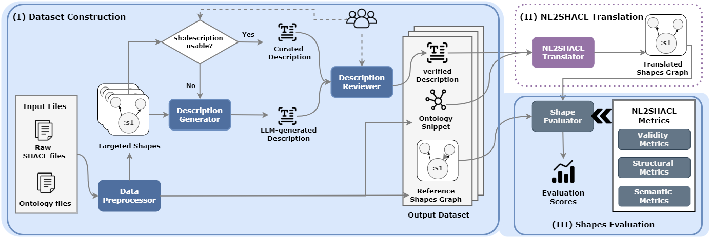
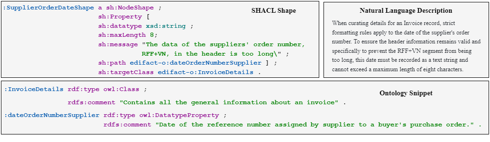

# NL2SHACL-Framework

[](https://opensource.org/licenses/MIT)
[](https://doi.org/10.5281/zenodo.20082565)
[](https://de-tum.github.io/NL2SHACL-Bench)

An extensible framework for benchmarking natural language to SHACL translation systems, introduced as part of NL2SHACL-Bench. The framework covers the full pipeline from dataset construction to evaluation, and is designed to be modular, extensible, and reproducible.



---

## Overview

The framework consists of three modules that together support end-to-end benchmarking of NL2SHACL systems.

**Dataset Construction** is a semi-automated pipeline for creating paired NL-SHACL datasets. Starting from existing SHACL shapes and ontologies, it extracts self-contained shape fragments, generates natural language descriptions using an LLM, and produces human-reviewed records ready for benchmarking. Each output record consists of a reference shapes graph, a natural language description, and an ontology snippet:



**NL2SHACL Translator** is a model-agnostic module that takes a natural language description and an ontology snippet as input and produces a translated SHACL shapes graph. Users can plug in arbitrary translation systems. The current implementation uses a prompting-based approach via the OpenRouter API.

**Shapes Evaluation** assesses the quality of translated shapes against reference shapes across three complementary dimensions: validity, structural similarity, and semantic equivalence.

---

## Repository Structure

```
NL2SHACL-Framework/
├── assets/                        # Images for documentation
├── Dataset-Construction/
│   ├── Data-Preprocessor/         # Fragment extraction and ontology augmentation
│   ├── Description-Generator/     # LLM-based NL description generation
│   └── Description-Reviewer/      # GUI for human review and annotation
├── NL2SHACL-Translator/           # Prompt generation and model inference
└── Shapes-Evaluation/             # Metric computation and evaluation pipeline
```

Each module folder contains its own README with detailed usage instructions.

---


## License

This project is licensed under the [MIT License](LICENSE).